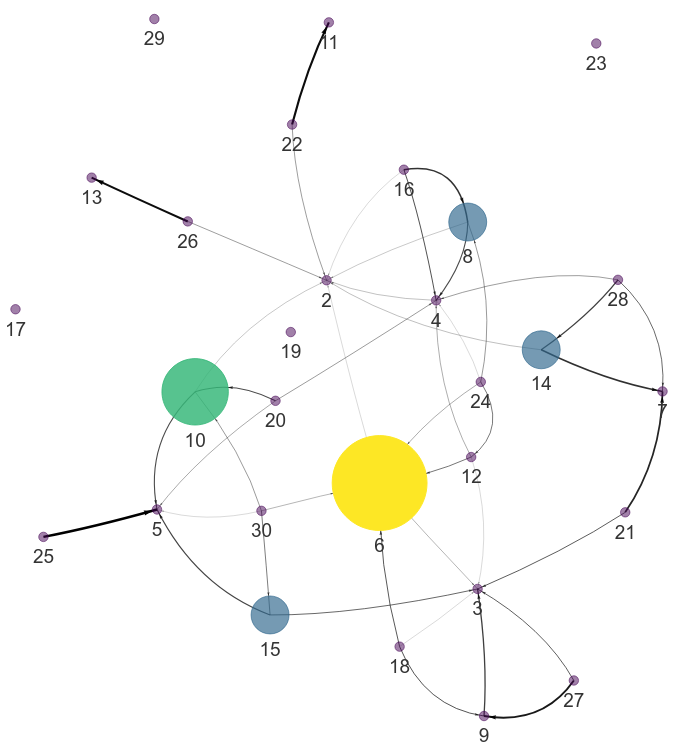

# MultiNet - Multi-Morbidity Network Analysis

## Build and visualise multi-morbidity networks to discover significant disease associations.

[](https://github.com/GIScience/badges#experimental)

This command line tool provides user-friendly and automated multi-morbidity network analysis.
Detect significant associations are correcting for confounding factors such as Age and Sex.
Includes community detection for un-directed networks.
Option to build directed networks when diagnosis times are available.

***Note: Directed network analysis is still experimental.***

## Table of contents

  * [Installation](#installation)
  * [Configuration](#configuration)
  * [Usage](#usage)
  * [Example output](#example-output)
  * [Contributing](#contributing)
  * [License](#license)
  * [Contact](#contact)

### Installation
Installation is possible via `pip` as shown below.

Unix/macOS
```bash
python3 -m pip install git+https://github.com/nhsx/morbidity_network_analysis.git
```

Windows
```bash
py -m pip install git+https://github.com/nhsx/morbidity_network_analysis.git
```

<details>
<summary><strong><font size="+0.5">Install within a Virtual Environment (optional)</font></strong></summary>

<details>
<summary><strong>Unix/macOS</strong></summary>

```bash
python -m venv esneft_tools
source esneft_tools/bin/activate
python3 -m pip install git+https://github.com/nhsx/morbidity_network_analysis.git
```
</details>

<details>
<summary><strong>Windows</strong></summary>

```bash
py -m venv esneft_tools
esneft_tools/Scripts/Activate.ps1
py -m pip install git+https://github.com/nhsx/morbidity_network_analysis.git
```

If running scripts is disabled on your system then run the following command before activating your environment.

```bash
Set-ExecutionPolicy -ExecutionPolicy RemoteSigned -Scope CurrentUser
```
</details>
</details>


## Configuration
MultiNet is configured via a single configuration file in YAML format.
The configuration describes the file-path of the input data and column names of the desired strata and diseases.
All columns provided in the configuration must be present in the input data.
MultiNet can automatically handle gzipped compressed files and file seperator can be configured to any relevant character.
The configuration file shown below is suitable for the example data generated by ```multinet simulate``` (see below).

```yaml
input: MultiNet-example.csv
edgeData: MultiNet-example-processed.csv.gz
networkPlot: exampleNetwork.html
wordcloud: MultiNet-example-wordcloud.svg
refNode: 30
fromRef: True
strata:
    - Age
excludeNode:
    - 1
radius: 2
codes:
    code1: time1
    code2: time2
    code3: time3
    code4: time4
seed: 42
```


## Usage
MultiNet can be run from the command line and additional help is provided via ```multinet --help```.

### Generate Example Data
The ```simulate``` sub-command generates suitably formatted input data for testing functionality.
It also writes an example config file in YAML format.

```bash
multinet simulate --config config.yaml > MultiNet-example.csv
```

### Stage 1 - Processing input and generate edge weights.
The ```process``` sub-command reads the input data and performs a stratified odds-ratio test (Mantel-Haenszel method) for each pair of morbidities.
The results are written in `.csv` format to the path defined by `edgeData:` in the configuration file.
The default simulated data should take approximately 5 minutes to process.

```bash
multinet process config.yaml
```

### Stage 2 - Network Construction and Visualisation
The ```network``` sub-command parses the output of ```multinet process``` into a network and generate an interactive visualisation.
The visualisation is written in `.html` format to the path defined by `networkPlot:` in the configuration file.

```bash
multinet network config.yaml
```

### Alternative Method - Run Full Workflow
MultiNet can be optionally run in a single command that combines stage 1 and stage 2.

```bash
multinet analyse config.yaml
```

However, it is generally advised to run each stage separately.
Optimal network visualisation parameters can be quickly explored without having to repeatedly re-run stage 1, which may require considerable compute time.


## Example output
The example network is designed to test MultiNet functionality and configuration.
The simulated data defines relationship among the nodes according to their numerical values.
Specifically, a given node is more likely to associate with numeric factors (e.g. node 8 -> 4, 2, 1)
MorbiNet can successfully recover these relationships in the network analysis.
Finally node relationships are temporal to mimic diagnosis time - in the simulated data larger numbers always occur before smaller.



### Contributing

Contributions are what make the open source community such an amazing place to learn, inspire, and create. Any contributions you make are **greatly appreciated**.

1. Fork the Project
2. Create your Feature Branch (`git checkout -b feature/AmazingFeature`)
3. Commit your Changes (`git commit -m 'Add some AmazingFeature'`)
4. Push to the Branch (`git push origin feature/AmazingFeature`)
5. Open a Pull Request

### License

Distributed under the MIT License. _See [LICENSE](./LICENSE) for more information._

### Contact

If you have any other questions please contact the author [Stephen Richer](mailto:stephen.richer@proton.me?subject=[GitHub]%20esneft_tools)
