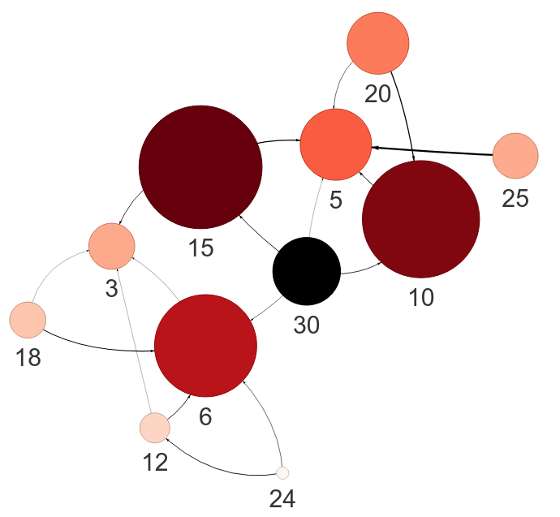
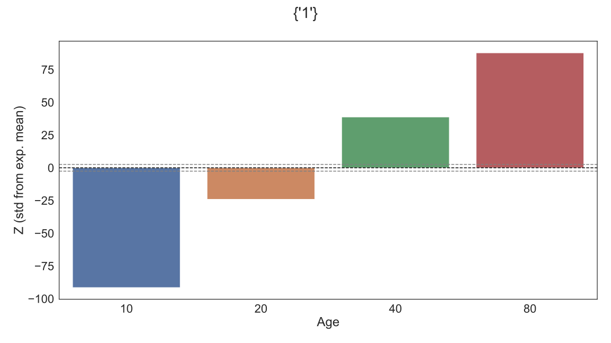

# MultiNet - Multi-Morbidity Network Analysis

## Build and visualise multi-morbidity networks to discover significant disease associations.

[](https://github.com/GIScience/badges#experimental)

This command line tool provides user-friendly and automated multi-morbidity network analysis.
Detect significant associations are correcting for confounding factors such as Age and Sex.
Includes community detection for un-directed networks.
Option to build directed networks when diagnosis times are available.

***Note: Directed network analysis is still experimental.***

## Table of contents

  * [Installation](#installation)
  * [Configuration](#configuration)
  * [Usage](#usage)
  * [Example output](#example-output)
  * [Contributing](#contributing)
  * [License](#license)
  * [Contact](#contact)

## Installation
Installation is possible via `pip` as shown below.

Unix/macOS
```bash
python3 -m pip install git+https://github.com/nhsx/morbidity_network_analysis.git
```

Windows
```bash
py -m pip install git+https://github.com/nhsx/morbidity_network_analysis.git
```

#### Install within a Virtual Environment (optional)
<details>
<summary><strong>Unix/macOS</strong></summary>

```bash
python -m venv multinet
source multinet/bin/activate
python3 -m pip install git+https://github.com/nhsx/morbidity_network_analysis.git
```
</details>

<details>
<summary><strong>Windows</strong></summary>

```bash
py -m venv multinet
multinet/Scripts/Activate.ps1
py -m pip install git+https://github.com/nhsx/morbidity_network_analysis.git
```

If running scripts is disabled on your system then run the following command before activating your environment.

```bash
Set-ExecutionPolicy -ExecutionPolicy RemoteSigned -Scope CurrentUser
```
</details>


## Configuration
MultiNet is configured via a single configuration file in YAML format.
The configuration describes the file-path of the input data and column names of the desired strata and diseases.
All columns provided in the configuration must be present in the input data.
MultiNet can automatically handle gzipped compressed files and file seperator can be configured to any relevant character.
The configuration file shown below is suitable for the example data generated by ```multinet simulate``` (see below).

```yaml
input: MultiNet-data.csv
edgeData: MultiNet-processed.csv.gz
networkPlot: MultiNet.html
codes:
    code1: time1
    code2: time2
    code3: time3
    code4: time4
strata:
    - Age
refNode: 30
maxNode: 10
wordcloud: MultiNet-wordcloud.svg
fromRef: true
excludeNode: 1
enrichmentPlot: MultiNet-enrichment.svg
enrichmentNode: 1
demographics: Age
seed: 42

```


## Usage
MultiNet can be run from the command line and additional help is provided via ```multinet --help```.

### Generate Example Data
The ```simulate``` sub-command generates suitably formatted input data for testing functionality.
It also writes an example config file in YAML format.

```bash
multinet simulate --config config.yaml MultiNet-data.csv
```

### Stage 1 - Processing input and generate edge weights.
The ```process``` sub-command reads the input data and performs a stratified odds-ratio test (Mantel-Haenszel method) for each pair of morbidities.
The results are written in `.csv` format to the path defined by `edgeData:` in the configuration file.
The default simulated data should take approximately 5 minutes to process.

```bash
multinet process config.yaml
```

### Stage 2 - Network Construction and Visualisation
The ```network``` sub-command parses the output of ```multinet process``` into a network and generate an interactive visualisation.
The visualisation is written in `.html` format to the path defined by `networkPlot:` in the configuration file.

```bash
multinet network config.yaml
```

### Alternative Method - Run Full Workflow
MultiNet can be optionally run in a single command that combines stage 1 and stage 2.

```bash
multinet analyse config.yaml
```

However, it is generally advised to run each stage separately.
Optimal network visualisation parameters can be quickly explored without having to repeatedly re-run stage 1, which may require considerable compute time.


## Example output
The example dataset is designed to test MultiNet functionality and illustrate its output.
The simulated data defines relationship among the nodes according to their numerical values.
Specifically, a given node is more likely to associate with numeric factors (e.g. node 8 -> 4, 2, 1).
MultiNet can successfully recover these directed relationships in the network analysis.


### Network Plot
The conventional way to visualise connections is via a Network plot.
The user may choose to visualise the entire network or, as below, the network centered on a reference node or nodes.
This is often helpful when working with large networks or if you are interested in specific nodes.

If a reference node is provided then node size and colour are scaled to the distance from the reference node.
Otherwise, node size and colour are scaled to betweenness centrality.

Configuration settings that control the output of the Network plot.
```yaml
refNode: 30 # Node(s) to centre the Network Plot (optional).  
maxNode: 10 # Plot nearest nodes to reference (if refNode is set).
excludeNode: 1 # Exclude node(s) from the visualisation (optional).
minDegree: 0 # Exclude nodes by degree (if refNode is NOT set).
stat: OR # Set weights by Odds Ratio (OR) or Risk Ratio (RR)
alpha: 0.01 # Exclude edges with adj. p-value less than alpha.
minObs: 100 # Exclude edges with too few observations.
```


 <br> Example network with reference node 30 and 10 closest nodes. Reference nodes are black.


### WordCloud
If reference nodes are provided then the user may also visualise relationships with a WordCloud.
Here, the size of each node is scaled to the distance from the reference node.
If the network is directed the WordCloud can either represent downstream nodes _from_ the reference or upstream nodes _to_ the reference.
This is controlled via `config['fromRef']`.

Configuration settings that control the output of the WordCloud plot.
```yaml
wordcloud: MultiNet-wordcloud.svg # Filename for plot (required).
refNode: 30 # Node(s) to centre the WordCloud.  
fromRef: true # Plot "from" reference or "to" reference (directed only)
excludeNode: 1 # Exclude node(s) from the visualisation (optional).
maxWords: None # Include N closest nodes, set None to include all.
```


 <br> Example WordCloud with all downstream nodes from reference node 30.


### Enrichment Analysis with Stratification
MultiNet also provides additional functionality to test specific nodes for enrichment against discrete grouping factors, such as demographics.
For illustration, the simulated example dataset enforces a positive enrichment of node "1" within older age groups.
Multiple demographic groups can be provided; each will be tested for enrichment of the specific node and stratified by the other groups.

Configuration settings that control the output of the Enrichment plot.
```yaml
enrichmentPlot: MultiNet-enrichment.svg # Filename for plot (required).
enrichmentNode: 1 # Node to assess enrichment within each demographic.
demographics: Age # Demographics of interest (required).
seed: 42 # Seed to control random permutations.
permutations: 1000 # Total permutations to perform.
minObs: 100 # Exclude stratified groups with too few observations.
```

```bash
multinet enriched config.yaml
```


 <br> Example enrichment of node 1 by Age.


### Contributing
Contributions are what make the open source community such an amazing place to learn, inspire, and create. Any contributions you make are **greatly appreciated**.

1. Fork the Project
2. Create your Feature Branch (`git checkout -b feature/AmazingFeature`)
3. Commit your Changes (`git commit -m 'Add some AmazingFeature'`)
4. Push to the Branch (`git push origin feature/AmazingFeature`)
5. Open a Pull Request


### License
Distributed under the MIT License. _See [LICENSE](./LICENSE) for more information._


### Contact
If you have any other questions please contact the author, [Stephen Richer](mailto:stephen.richer@proton.me?subject=[GitHub]%20multinet).
